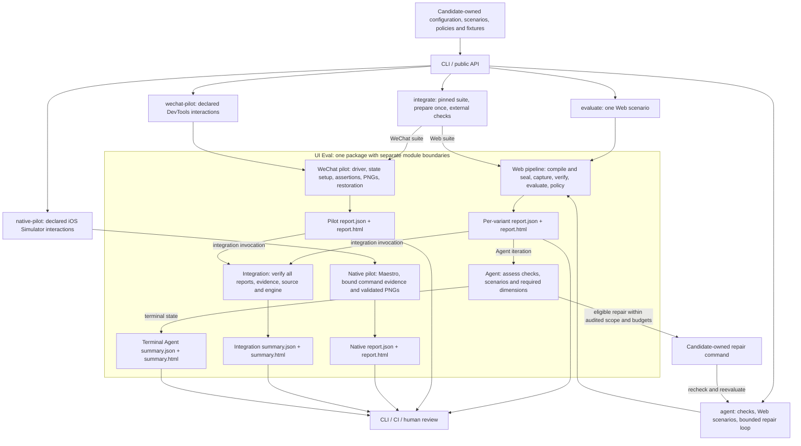
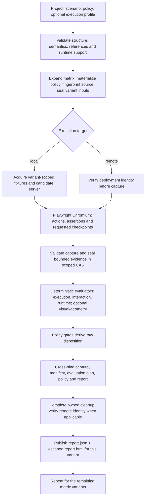

# System design overview

UI Eval is a standalone, local-first TypeScript modular monolith. Candidate
projects declare the acceptance conditions; the engine turns those conditions
into sealed execution inputs, observed evidence, deterministic measurements and
validated machine/human reports. Its modules share one package and are not
separately deployed services.

This overview describes the runtime in the checkout containing this document.
Consumers select an exact source revision; documentation or forward schemas do
not enable a capability absent from that revision. For implementation detail,
see [Architecture](architecture.md), [Contracts](contracts.md) and
[Current limitations](limitations.md).

## Overall flow

Solid arrows show execution/data flow. Labeled return arrows are conditional on
the invoking command: a direct evaluation does not automatically start an
integration suite or an Agent loop. Integration and Agent are separate
orchestration modes, not an automatic nested sequence.

`init` produces authoring scaffolding and `doctor` checks prerequisites. Neither
substitutes for the evaluation or acceptance paths shown above.

The iOS Simulator pilot is a separate executable path. It does not extend the
Web pipeline or Agent, and `integrate` does not register it. Its interaction/PNG
evidence does not certify installed binary provenance, runtime health or design
conformance; see [Experimental native evidence pilot](native-pilot.md).

## Web: how one scenario becomes evidence and a decision

The diagram shows dependencies rather than every internal write. Intermediate
manifest/capture/plan/policy artifacts can exist before the final report pair.
Remote verification occurs around capture; a remote run does not acquire or
stop a candidate server and cannot use local mock-server fixtures. Final Web
report publication waits for successful owned server/fixture cleanup.

The compiler's scenario plan declares **what to execute**. The later evaluation
plan binds **which actual evidence and evaluator configuration support the
decision**. The report contract verifies that these records agree. Keeping both
plans prevents observations from being detached from the declared scenario.

CAS means content-addressed storage. Artifact scope, digest, size and sensitivity
are verified when evidence is used. Human report links expose permitted aliases;
sensitive evidence can remain CAS-only. Storage is local and is not encrypted.

## Integration: complete acceptance across a project

```mermaid
flowchart LR
  Pin["Verify engine pin and snapshot candidate source"] --> Prepare["Optional prepare: once per invocation"]
  Prepare --> Before["Declared before checks"]
  Before --> Scenarios["Every mandatory scenario and its complete variant floor"]
  Scenarios --> After["Declared after checks"]
  After --> Revalidate["Revalidate report pairs and underlying evidence"]
  Revalidate --> Identity["Recheck candidate source and engine pin"]
  Identity --> Decision["Aggregate acceptance and stage durations"]
  Decision --> Pair["Publish canonical summary.json and derived summary.html"]
```

This is the successful execution path. Candidate check failures do not remove
the remaining mandatory scope. Infrastructure failures stop new scenarios;
after checks may run only when the required source identity exists and cleanup
has settled. Unsettled cleanup stops further commands. Unexecuted mandatory
stages, invalid evidence or infrastructure failure cannot produce a pass.

The engine verifies a reviewed checkout and never clones, installs or upgrades
it during integration. Candidate-owned prepare/check commands receive bounded
execution context and retain ownership of framework builds, synthetic APIs and
business assertions. Preparation can serve all scenarios and variants in that
invocation; each Web variant still has its own server/browser lifecycle. There
is no cross-run build cache or attestation of ignored build output/dependencies.

A browser report describes the browser observations. The integration summary
describes complete declared acceptance, including external checks. A failed API
contract check can therefore fail the integration while preserving a passing
browser report. The summary does not rewrite the original observation.

Consumers remain responsible for a reviewed bootstrap around the selected
engine. The engine owns acceptance aggregation; a bootstrap must not treat an
empty successful process exit as acceptance. Exact consumer transport/handoff
checks belong to that consumer and are not additional engine guarantees. See
[Integration acceptance runner](integration-runner.md).

## Agent: a controlled optimization loop

An Agent iteration runs declared project checks, then Web scenarios when those
checks permit evaluation, and assesses required acceptance dimensions. Only the
complete acceptance conditions authorize `accepted`. A repair command receives
findings, changes candidate files within a declared scope, and is followed by
file-hash auditing and a new iteration. Iteration/time/mutation budgets and
progress plateau bound the loop.

Scenario/evaluator infrastructure failure does not authorize product repair.
Project-check failures separately follow their declared `onFailure` policy,
which defaults to `repair`; external infrastructure preconditions should use
`block` when failure must prevent repair. Incomplete evaluator cleanup blocks
further work. Remote mode disables repair and evidence reuse; local reuse
is confined to validated immutable results within the same Agent run and source
snapshot. These audit controls do not provide OS isolation. The repair worker
cannot change a raw report into a pass. See [Constrained Agent Loop](agent.md).

## Why the responsibilities are separated

| Boundary | Responsibility | Benefit |
| --- | --- | --- |
| Candidate / engine | Candidate owns app-specific build, auth, fixtures and business paths; engine consumes contracts and narrow interfaces. | One engine can evaluate different projects without importing their application code. |
| Capture / evaluation | Capture records observations; evaluators read immutable evidence and emit deterministic measurements/findings. | Browser execution is separated from the criteria used to judge it. |
| Evaluation / policy | Evaluators produce facts; restricted policy expressions decide acceptance. | Reviewed gates can evolve without letting a model invent or weaken acceptance. |
| Raw reports / suite summaries | Reports describe individual observations; integration/Agent summaries add declared acceptance conditions. | External rejection and infrastructure limits remain visible without rewriting evidence. |
| JSON / HTML | Validated JSON is canonical; escaped HTML is its reading projection. | CI and humans receive synchronized results; failed summary publication fails completion. |
| Current / forward contracts | Executable runtime registration is distinct from reserved schema shapes. | A declared native/design/governance type cannot silently become a support promise. |

Project configuration is trusted executable input. Candidate page/evidence data
is untrusted. Path containment, authenticated origin/egress guards, scoped CAS
integrity, sensitivity handling, evidence limits and owned cleanup enforce the
implemented boundaries. OS/process/network isolation remains an operator
responsibility; see [Security model](security-model.md).

## Decisions and capability limits

| Path | Scope of a usable result |
| --- | --- |
| Web `evaluate` | Declared steps/assertions, runtime observations and configured evidence/evaluators across the scenario matrix. Visual comparison is advisory; geometry requires explicit policy configuration. |
| WeChat pilot | Declared DevTools interactions, assertions and validated PNG checkpoints with state restoration. It has its own contract and does not execute the Web evaluator/policy pipeline or certify real-device rendering. |
| iOS Simulator pilot | Restricted Maestro interactions, bound command evidence and validated PNG checkpoints under its own contract. It is independent of Web policies, Agent and Integration; installed binary/build-to-source provenance and release assurance remain unproven. |
| `integrate` | Every declared scenario/check plus evidence and identity verification for a Web or experimental WeChat suite. |
| `agent` | Declared checks, Web scenarios and acceptance dimensions, with an optional bounded repair loop. |
| Offline design tools | Tailwind CSS token production, token/config drift checks and offline audits. Evaluators consume reviewed sealed configuration, not the design producer itself. |
| Generic native/design governance forward contracts | Reserved declarations; the separate iOS Simulator pilot does not enable generic native contracts. Online Figma sync, Android and real-device capture are not registered. |

For `evaluate` and `integrate`, pass is exit `0`, candidate failure is `1`,
configuration/infrastructure/invalid or inconclusive evidence is `2`, and human
review is `3`. A product defect and an inability to establish evidence are
different outcomes. A pass covers only the declared and actually executed scope.

Agent terminal results use a separate acceptance mapping: `0` for `accepted`,
`1` for other terminal states. Inspect its summary status/reason and underlying
reports to distinguish blocking conditions. Pre-terminal CLI exceptions return
`2`; SIGINT/SIGTERM retain `130`/`143`. See the [Agent handoff](agent.md).

Mermaid-aware Markdown viewers render these diagrams. The generated technical
HTML reading view retains the diagram source as code blocks. Markdown remains
canonical.
